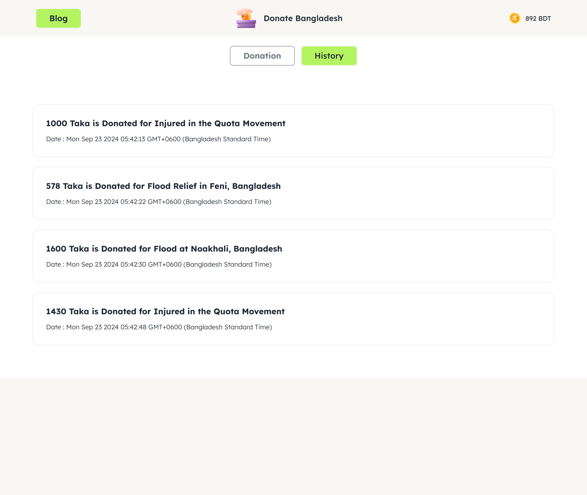
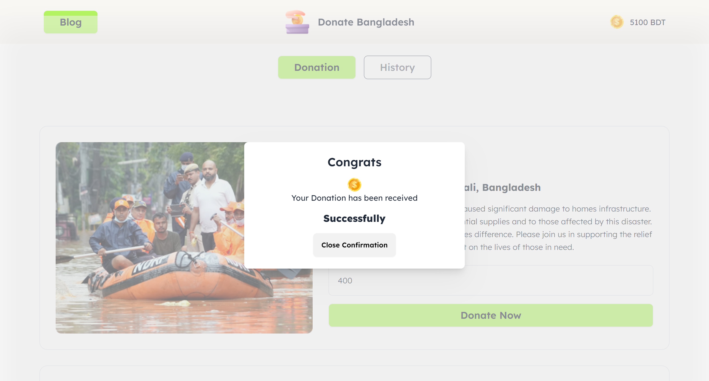

##  DONATE BANGLADESH

 
 

## Overview

Donate Bangladesh is a web application designed for easy online donations, allowing users to manage their donation history and account balance efficiently.

## Design

- **Navbar**: Centered logo, "Blog" button, account balance, and "Donation" & "History" buttons.
- **Donation Cards**: Three cards featuring an image, title, info, current donation amount, input field, and a "Donate Now" button.
- **History Section**: Hidden initially, displays donation history upon interaction.

## Functionalities

- Toggle between donation data and history.
- Deduct donation amount from the account balance and update donation cards.
- Validate input for valid numbers, ensuring no negative donations.
- Display transaction notifications in the history section.

## Challenges

- Sticky navbar at the top.
- Blog page with FAQs about the DOM.
- Active status toggle for buttons.
- Static modal for donation success messages.
- Reusable functions for efficiency.
- Responsive design for various devices.

## Getting Started

Clone the repository and open `index.html` in your browser to explore the application.

## Technologies Used

- HTML
- CSS (Tailwind CSS)
- JavaScript
- DaisyUI
- Figma, Pixso
